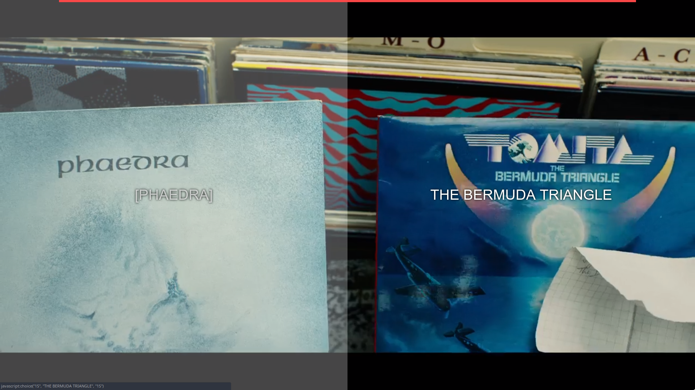

# Bandersnatch Interactive Player (dựa trên html5 video player)
Công cụ hỗ trợ xem tập phim Bandersnatch **có tương tác**

[Ấn vào đây để mở player](https://mehotkhan.github.io/BandersnatchInteractive/)

## Hướng dẫn sử dụng
Tải file phim > mở trang web trên > kéo thả file phim vào và thưởng thức.

## Screenshot
  

## Lưu ý

* Hoạt động tốt nhất trên các trình duyệt Chromium
* Đã chọn sẵn phụ đề Việt làm mặc định, không cần chọn lại.

## Phím tắt

* <kbd>F</kbd> - Toàn màn hình
* <kbd>R</kbd> - Xem lại từ đầu
* <kbd>→</kbd>, <kbd>←</kbd> - Tua tới phân đoạn trước/sau (hoặc phần tương tác)
* <kbd>↑</kbd>, <kbd>↓</kbd> - Tăng/giảm tốc độ phát lại
* <kbd>Space</kbd> - Tạm dừng/phát

## Credit
* Mã nguồn [joric work](https://github.com/joric/bandersnatch)
* Repo (tiếng Anh) gốc [mehotkhan](https://github.com/mehotkhan/BandersnatchInteractive)
